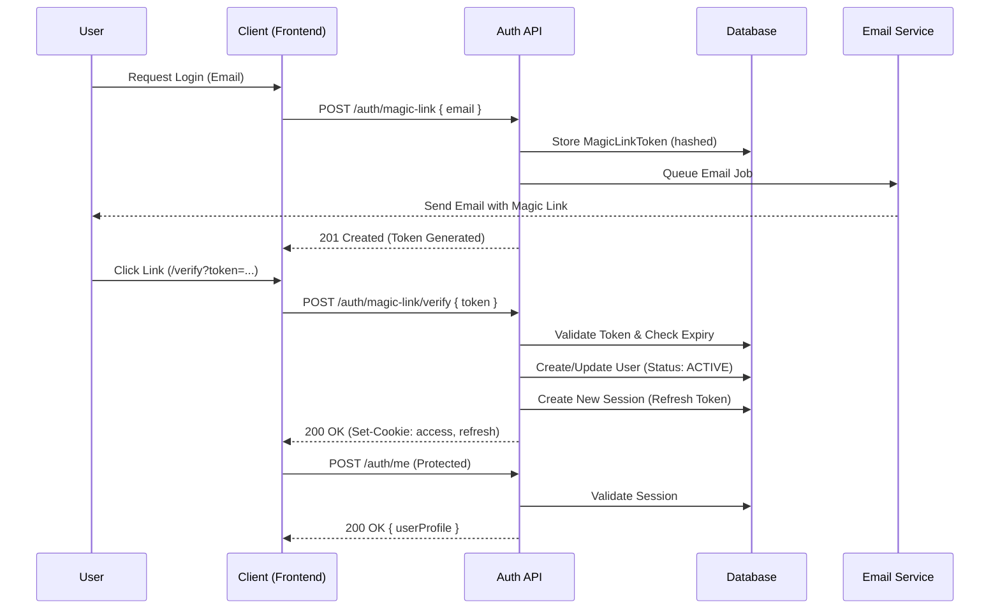

# Authentication System

## Overview

The Storagie API uses **Magic Link authentication** - a passwordless authentication flow where users receive a secure link via email to access their accounts.

## Architecture



## Components

| Component             | Interface                   | Implementation                   | Token                                |
| --------------------- | --------------------------- | -------------------------------- | ------------------------------------ |
| Email                 | `IEmailService`             | `NodemailerEmailService`         | `EMAIL_SERVICE`                      |
| Magic Link Repository | `IMagicLinkTokenRepository` | `PrismaMagicLinkTokenRepository` | `REPOSITORY_TOKENS.MAGIC_LINK_TOKEN` |
| Session Repository    | `ISessionRepository`        | `PrismaSessionRepository`        | `REPOSITORY_TOKENS.SESSION`          |

## Authentication Flow

### Magic Link Request

```
POST /api/auth/magic-link
Content-Type: application/json

{"email": "user@example.com"}
```

1. Generate cryptographically secure random token
2. Hash token with bcrypt and store in `MagicLinkToken` table
3. Queue email job via `IQueueService`
4. Email worker sends magic link via Nodemailer

### Magic Link Verification

```
POST /api/auth/magic-link/verify?email=user@example.com
Content-Type: application/json

{"token": "64-character-hex-token"}
```

1. Validate token against stored bcrypt hash (checks valid and **recently used** tokens to handle race conditions)
2. Create/activate user if needed (status: PENDING → ACTIVE, role: GUEST → USER)
3. Delete existing session (single session policy)
4. Create new session with bcrypt-hashed refresh token
5. Generate JWT tokens and set HttpOnly cookies

### Token Configuration

| Token      | Payload                | TTL              | Cookie Path         |
| ---------- | ---------------------- | ---------------- | ------------------- |
| Access     | `sub`, `email`, `role` | 10 min (default) | `/`                 |
| Refresh    | `sub`, `sid`           | 7 days (default) | `/api/auth/refresh` |
| Magic Link | Random hex             | 30 min           | N/A                 |

### Cookies

Both tokens are delivered as HttpOnly, Secure, SameSite=Strict cookies:

```typescript
response.cookie("access", accessToken, {
  httpOnly: true,
  secure: process.env.COOKIE_SECURE === "true",
  sameSite: "strict",
  path: "/",
  maxAge: 600000, // 10 min
});
```

## API Endpoints

| Method | Route                         | Auth | Description            |
| ------ | ----------------------------- | ---- | ---------------------- |
| POST   | `/api/auth/magic-link`        | ❌   | Request magic link     |
| POST   | `/api/auth/magic-link/verify` | ❌   | Verify and login       |
| POST   | `/api/auth/refresh`           | ❌   | Refresh access token   |
| POST   | `/api/auth/logout`            | ✅   | Logout (clear session) |
| POST   | `/api/auth/me`                | ✅   | Get current user       |

## Error Codes

The auth module uses custom exceptions with the following codes:

| Code                         | Status | Description                  |
| ---------------------------- | ------ | ---------------------------- |
| `AUTH_INVALID_TOKEN`         | 401    | Token inválido ou expirado   |
| `AUTH_TOKEN_EXPIRED`         | 401    | Token expirado               |
| `AUTH_REFRESH_TOKEN_MISSING` | 401    | Refresh token não encontrado |
| `AUTH_REFRESH_TOKEN_INVALID` | 401    | Refresh token inválido       |
| `AUTH_SESSION_EXPIRED`       | 401    | Sessão expirada              |
| `AUTH_USER_INACTIVE`         | 403    | Usuário inativo              |
| `AUTH_USER_BLOCKED`          | 403    | Usuário bloqueado            |

## Usage

### Global Authentication

Authentication is enabled globally using `APP_GUARD`. By default, **all endpoints are protected** and require a valid Access Token.

### Public Endpoints

To make an endpoint public (skip authentication), use the `@Public()` decorator:

```typescript
import { Controller, Post } from "@nestjs/common";
import { Public } from "@modules/auth/infrastructure/decorators/public.decorator";

@Controller("auth")
export class AuthController {
  @Post("login")
  @Public()
  login() {
    return { message: "Public Route" };
  }
}
```

### Accessing User Data

Since the guard validates the token globally, the user object is available in the request. Use the `@CurrentUser` decorator:

```typescript
@Controller("protected")
export class ProtectedController {
  @Get()
  // No @UseGuards needed - it's global!
  getProtected(@CurrentUser() user: RequestUser) {
    return { message: `Hello ${user.email}`, userId: user.userId };
  }
}
```

### Getting User Info

```typescript
@CurrentUser() user: RequestUser          // Full user object
@CurrentUser('userId') userId: string     // Just userId
@CurrentUser('email') email: string       // Just email
@CurrentUser('role') role: string         // Just role
```

## Environment Variables

```bash
# JWT Secrets (min 32 characters)
ACCESS_SECRET=your-super-secret-access-key-min-32-chars
REFRESH_SECRET=your-super-secret-refresh-key-min-32-chars

# Token Expiration (numbers only)
ACCESS_EXPIRES_IN=10          # minutes
REFRESH_EXPIRES_IN=7          # days
MAGIC_LINK_EXPIRES_IN=1800    # seconds (30 min)

# Magic Link URL (frontend or dashboard + callback)
MAGIC_LINK_CALLBACK_PATH=/auth/verify

# Cookie Settings
COOKIE_DOMAIN=localhost
COOKIE_SECURE=false  # true in production
```

## Database Models

### MagicLinkToken

```prisma
model MagicLinkToken {
    id        String    @id @default(cuid())
    email     String
    tokenHash String    @map("token_hash")
    expiresAt DateTime  @map("expires_at")
    usedAt    DateTime? @map("used_at")
    createdAt DateTime  @default(now()) @map("created_at")

    @@index([email, expiresAt])
    @@map("magic_link_tokens")
}
```

### Session

```prisma
model Session {
    id               String   @id @default(cuid())
    userId           String   @unique @map("user_id")
    refreshTokenHash String   @map("refresh_token_hash")
    userAgent        String?  @map("user_agent")
    ipAddress        String?  @map("ip_address")
    expiresAt        DateTime @map("expires_at")
    createdAt        DateTime @default(now()) @map("created_at")

    user User @relation(fields: [userId], references: [id], onDelete: Cascade)

    @@index([expiresAt])
    @@map("sessions")
}
```

## Security Features

- **Passwordless**: No password storage or complexity management
- **Single Session**: New login invalidates previous session
- **Token Hashing**: Both magic link and refresh tokens stored as bcrypt hashes
- **HttpOnly Cookies**: Tokens not accessible via JavaScript
- **Secure Cookies**: HTTPS only in production
- **SameSite=Strict**: CSRF protection
- **Short TTL**: Access tokens expire in 10 minutes
